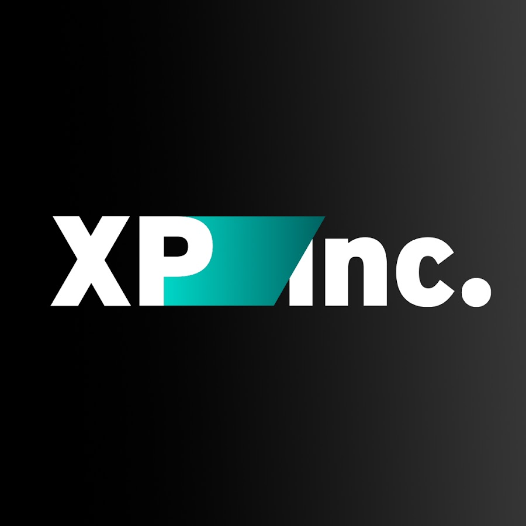

# Inovacamp - XP Inc

 

# XP Control

## BBG

## Integrantes: 
- <a href="https://www.linkedin.com/in/maria-vit%C3%B3ria-dos-santos/">Maria Vitória</a>
- <a href="https://www.linkedin.com/in/maria-vit%C3%B3ria-dos-santos/">Matheus Ferreira</a> 
- <a href="https://www.linkedin.com/in/maria-vit%C3%B3ria-dos-santos/">Paulo Henrique</a> 

## Descrição

&emsp; O presente projeto, XP Control, é uma solução mobile de intervenção comportamental e gestão de crise financeira voltada para jovens da Geração Z (18 a 30 anos). A proposta surgiu a partir da identificação de um cenário crítico no Brasil: mais de 12,5 milhões de jovens endividados, agravado pela ascensão das apostas online (bets) e pela falta de controle de gastos impulsivos. O desafio central abordado é a desconexão entre a educação financeira tradicional — vista como lenta e teórica — e a busca dessa geração por recompensas imediatas.

&emsp; A solução consiste em um sistema de "Gamificação Bimodal" que opera em dois estágios rígidos e complementares: o Modo Resgate e o Modo Investidor. A aplicação utiliza Open Finance para realizar um diagnóstico profundo da saúde financeira do usuário, identificando não apenas dívidas bancárias, mas também padrões de comportamento de risco, como transferências recorrentes para casas de aposta. Para capturar dívidas informais (familiares ou externas), o sistema implementa uma triagem inicial conduzida por Inteligência Artificial.

&emsp; O componente central de intervenção da plataforma é um assistente virtual proativo, baseado em IA Generativa (LLM). Este assistente atua como um copiloto financeiro, monitorando o fluxo de caixa em tempo real e sugerindo estratégias matemáticas de priorização de pagamentos. Ele é capaz de gerar scripts de negociação personalizados para que o usuário envie aos credores e de automatizar a retenção de recursos em "Cofrinhos Inteligentes", que aplicam o dinheiro em CDBs de liquidez diária da XP enquanto o montante de quitação é acumulado.

&emsp; A inovação disruptiva do projeto reside na mecânica de bloqueio: o usuário endividado tem o acesso ao simulador de investimentos (Jogo 2) vetado até que saneie suas finanças no simulador de estratégia (Jogo 1). No Jogo 1, o usuário resolve desafios de alocação de recursos e ganha moedas virtuais que se convertem em descontos reais ou cashback para abatimento de dívidas. Somente após a quitação dos passivos críticos, o "Modo Investidor" é desbloqueado, permitindo que o usuário acesse ferramentas de investimento, durante todo o processo, o usuário pode aprimorar seus conhecimentos através da plataforma da XP Educação.

&emsp; Em síntese, o XP Control oferece uma abordagem tecnológica que hackeia o sistema de dopamina do jovem, substituindo o vício em apostas pela estratégia de "apostar contra a dívida". Ao unir gestão de crise, educação gamificada e integração com o ecossistema de produtos XP, o projeto transforma devedores crônicos em investidores qualificados, gerando valor social e de negócio.

## Estrutura de pastas

Dentre os arquivos e pastas presentes na raiz do projeto, definem-se:

- <b>assets</b>: aqui estão os arquivos relacionados a parte gráfica do projeto, ou seja, as imagens e vídeos que os representam.

- <b>document</b>: aqui está a documentação do projeto, contento a arquitetura da solução e a didática do produto.

- <b>src</b>: todo o código fonte criado para o desenvolvimento do projeto, incluindo firmware, backend e frontend.

- <b>README.md</b>: arquivo que serve como guia e explicação geral sobre o projeto (o mesmo que você está lendo agora).

## 📋 Licença/License

<a href="https://github.com/mavisanttos/XP_Control">XP Control</a> © 2025 by <a href="https://github.com/mavisanttos/XP_Control">Maria Vitória, Matheus Ferreira, Paulo Henrique</a> is licensed under <a href="https://creativecommons.org/licenses/by/4.0/">CC BY 4.0</a>